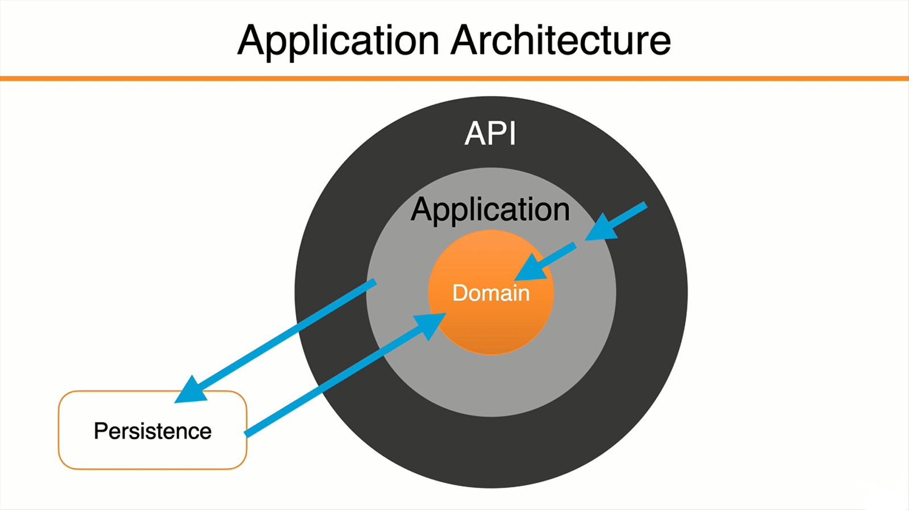
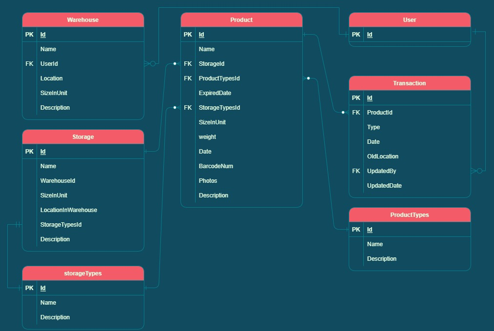

# Warehouse-MS

## Team members

- Mohammad Sarayrah (Team leader)
- Fuad Abuawad
- Alaaldin alhanini
- Bashar Owainat

## Introduction

Warehouse-MS is the center of manufacturing and supply chain operations because they hold all of the material used or produced in those processes, from raw materials to finished goods. A warehouse-MS aims to help ensure that goods and materials move through warehouses in the most efficient and cost-effective way. And make sure the product sits in the right place in the warehouse, Organizing the warehouse in terms of space and type of stored goods and making sure of the time and entry and exit of goods from the warehouses, A Warehouse-MS handles many functions that enable these movements, including inventory tracking, picking, receiving and putaway.

- Warehouse Processing

## Problem Domain

Implementing a Warehouse-MS can help an organization reduce labor costs, improve inventory accuracy, improve flexibility and responsiveness, decrease errors in picking and shipping goods, and improve customer service. Modern warehouse management systems operate with real-time data, allowing the organization to manage the most current information on activities like orders, shipments, receipts, and any movement of goods.

We think business software should cover complex needs without being complicated. Our mission is to provide software that is intuitive, full-featured, tightly integrated, effortless to upgrade, all while running smoothly for every business, every user.

## Application Architecture

## Application Projects

## Wireframes

- Home Page

- Login Page

- SignUp Page

- Warehouse Page

- Storage Page

- Storage Details Page

- Product Page

## User Stories

- As a user I want to have to the ability to track the capacity in my warehouse so that I can know how much space is left.
- As a user I want to have the ability to sort the products by arrival date, expiration date, weight .
- As a user I want to have the ability to filter the products by their type and storage type .
- As an admin I want to have a page that contains all the notification about my warehouse .
- As an admin I want to have the ability to add and delete products in my warehouse .
- As a user I want to have the ability to change the storage location .
- As a user I want to have the ability to distribute the products based on weight .
- As an admin I want to have the ability to add a storing type .
- As an admin I want to have the ability to add a product type .
- As an admin I want to have the ability to choose the product type .
- As an admin I want to have the ability to add a new warehouse .
- As an admin I want to have the ability to divide the warehouse into small parts .
- As admin I have ability to add new notification to notification page .
- As admin I have ability to create a new account .
- As  admin I have ability to add the new users (supervisors) .
- As usual I have ability to show my profile and edit the information .

## Domain Modeling

Warehouse-MS ER digram

## Functionalities

Features of warehouse management systems Many features are common to WMS software products. 

- They include the following:

- Warehouse design, enables organizations to customize workflow and picking logic to make sure that the warehouse is designed for optimized inventory allocation. The WMS establishes bin slotting that maximizes storage space and accounts for variances in seasonal inventory.

- Inventory tracking enables the use of advanced tracking and automatic identification and data capture(AIDC)  systems, including RFID and barcode scanners to make sure that goods can be found easily when they need to move.

- Receiving and putaway, which allows inventory putaway and retrieval, often with pick-to-light or pick-to-voice technology to help warehouse workers locate goods.

- Picking and packing goods, including zone picking, wave picking and batch picking. Warehouse workers can also use lot zoning and task interleaving functions to guide the pick-and-pack tasks in the most efficient way.

- Shipping, which enables the WMS to send bills of lading ahead of the shipment, generate packing lists and invoices for the shipment, and send advance shipment notifications to recipients.

- Labor management, helps warehouse managers monitor workers' performance by using key performance indicators that indicate workers who perform above or below standards.

- Yard and dock management, which assists truck drivers coming into a warehouse to find the right loading docks. More complex use of yard and dock management enables cross-docking and other functions of inbound and outbound logistics.

- Reporting, helps managers analyze the performance of warehouse operations and find areas to improve.

